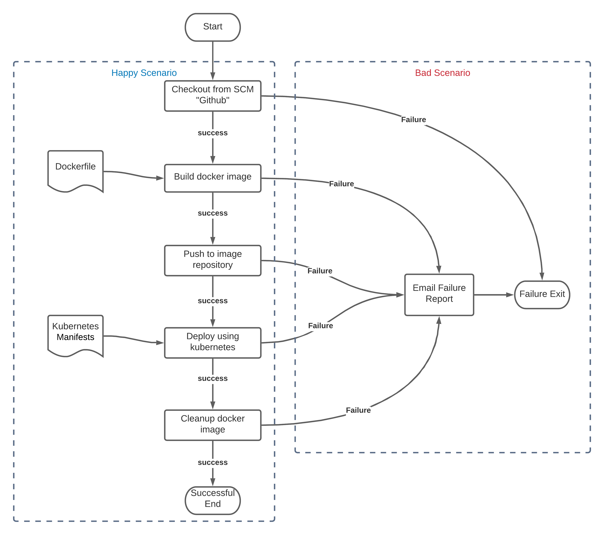

# **Instabug's 2021 Infrastructure Challenge**

## Original author README

```md
# GoViolin

GoViolin is a web app written in Go that helps with violin practice.

Currently hosted on Heroku at https://go-violin.herokuapp.com/

GoViolin allows practice over both 1 and 2 octaves.

Contains:
* Major Scales
* Harmonic and Melodic Minor scales
* Arpeggios
* A set of two part scale duet melodies by Franz Wohlfahrt
```

# Prerequisites

* Install [Docker](https://docs.docker.com/engine/install/)
* Install [Jenkins](https://www.jenkins.io/download/)

	Add the following plugins to jenkins:
	1. Docker plugin
	2. Docker Pipeline
	3. Pipeline
	4. Blue Ocean **(Optional)**
  5. Email Extension
  > Note: you need to configure `Email Extension Plugin` with appropriate email settings, you can follow this [Tutorial](https://www.360logica.com/blog/email-notification-in-jenkins/)
* Install [Kubectl](https://kubernetes.io/docs/tasks/tools/)
* Configure jenkins to use docker.
```bash
usermod -aG docker jenkins
```
* Add your [DockerHub](https://hub.docker.com/) -or any image repository- credentials into jenkins credentials manager.
* Configure your `kubectl` access configuration, [Example Here](https://kubernetes.io/docs/tasks/access-application-cluster/configure-access-multiple-clusters/)

# Planning

Planning the pipeline for each `Happy/Bad` scenario goes according to the following figure.



# Implementation

### Created [Dockerfile](Dockerfile) for the image using [Docker Multistage Builds](https://docs.docker.com/develop/develop-images/multistage-build/) configuration including:
* Downloading application dependencies
* Run application tests
* Build application binaries
* Create a new [Scratch](https://hub.docker.com/_/scratch) image with only application binaries and required files for running
* Exposing port `8080`
* Defining image entrypoit for running the application

### Created [Jenkinsfile](Jenkinsfile) with the following details:
> Note: you need to change the `"dockerImage"` variable with your [DockerHub](https://hub.docker.com/) -or any image repository- `<username>/<repository-name>`

> Note: if you are using another image repository other than [DockerHub](https://hub.docker.com/) then you need to change the url parameter in the `withDockerRegistery` function according to the following example: 
```groovy
withDockerRegistry(credentialsId: '<repository credentials>', url: '<repository URL>'){
                    sh 'docker login'
                    sh 'docker push ${dockerImage}'
                }
```
* Building docker image using [Dockerfile](Dockerfile)
* Pushing the created image to the desired image repository
* Deploying the docker image using kubernetes with [kubernetes-deployment-service.yaml](kubernetes-deployment-service.yaml).
* Cleanup the created docker image
* Handling all failures for each stage and notify the user by emailing failure report
> Note: you need to change the `userEmail` variable in the [Jenkinsfile](Jenkinsfile) with your email address as follows `userEmail = '<your email address>'`

### Created [kubernetes-deployment-service.yaml](kubernetes-deployment-service.yaml) file as kubernetes manifest to deploy the application as follows:
* Created a `deployment` with 1 replica
* Deployment contains the application image and the running port
> Note: you may need to change your image name to pull the image from your image repository you defined in the [Jenkinsfile](Jenkinsfile), follow the below example.
```yaml
containers:
      - name: go-app-image
        image: <username/repositoryname> OR <Image name>
        ports:
        - containerPort: 8080
```
* Created a `service` with 'LoadBalancer' type to expose the previous deployment, it will forward the incoming traffic from port `80` to the deployment with target port of `8080`